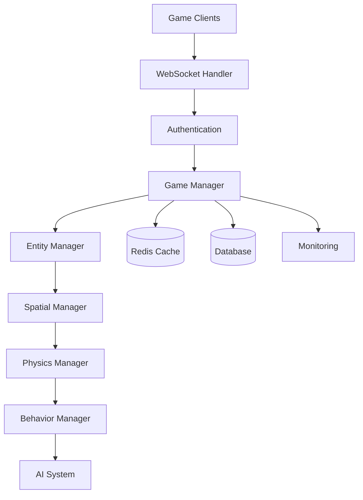

# WsCore Server Architecture Improvements

## Monolithic Architecture Optimization Strategy

### Design Philosophy: Simple, Fast, Scalable Monolith

**Core Principle**: Leverage .NET's performance capabilities to create a highly efficient monolithic server that can handle significant load through vertical scaling and optimization rather than horizontal distribution.

## Current Architecture Analysis

### Strengths of Current Design
1. **Simple Deployment**: Single binary deployment
2. **Low Latency**: No inter-service communication overhead
3. **Atomic Operations**: Game state consistency within single process
4. **Resource Efficiency**: Minimal serialization overhead

### Identified Optimization Opportunities
1. **Memory Management**: .NET object pooling and memory optimization
2. **CPU Utilization**: Multi-threaded game logic processing
3. **Spatial Partitioning**: Reduce unnecessary entity updates
4. **Connection Optimization**: Efficient WebSocket handling
5. **Caching Strategy**: In-memory and distributed caching

## Optimized Monolithic Architecture

### High-Level Architecture



### Component Architecture


## .NET Performance Optimizations

### 1. Memory Management Optimization

```csharp
public class MemoryOptimizedGameServer
{
    private readonly ObjectPool<Entity> _entityPool;
    private readonly ArrayPool<byte> _bufferPool;

    public MemoryOptimizedGameServer()
    {
        _entityPool = new ObjectPool<Entity>(() => new Entity(), entity => entity.Reset());
        _bufferPool = ArrayPool<byte>.Shared;
    }

    public Entity GetEntityFromPool()
    {
        return _entityPool.Get();
    }

    public void ReturnEntityToPool(Entity entity)
    {
        _entityPool.Return(entity);
    }
}
```

### 2. Multi-Threaded Game Loop

```csharp
public class ParallelGameLoop
{
    private readonly ParallelOptions _parallelOptions;

    public ParallelGameLoop(int maxDegreeOfParallelism)
    {
        _parallelOptions = new ParallelOptions
        {
            MaxDegreeOfParallelism = maxDegreeOfParallelism
        };
    }

    public void UpdateGameState(GameModel gameModel)
    {
        // Parallel entity updates by spatial regions
        var regions = SpatialManager.GetAllRegions();

        Parallel.ForEach(regions, _parallelOptions, region =>
        {
            UpdateRegionEntities(region);
        });

        // Sequential physics resolution
        ResolvePhysicsCollisions(gameModel);
    }
}
```

### 3. Spatial Partitioning System

```csharp
public class SpatialPartitioningManager
{
    private readonly SpatialGrid<Entity> _spatialGrid;
    private readonly int _gridSize = 100; // World units per grid cell

    public SpatialPartitioningManager(int worldWidth, int worldHeight)
    {
        _spatialGrid = new SpatialGrid<Entity>(worldWidth / _gridSize, worldHeight / _gridSize);
    }

    public void UpdateEntityPosition(Entity entity)
    {
        _spatialGrid.UpdatePosition(entity.Id, entity.Position);
    }

    public IEnumerable<Entity> GetNearbyEntities(Vector2 position, float radius)
    {
        var nearbyCells = _spatialGrid.GetCellsInRadius(position, radius);
        return nearbyCells.SelectMany(cell => cell.Entities);
    }
}
```

### 4. Connection Pooling and Optimization

```csharp
public class OptimizedWebSocketManager
{
    private readonly ConcurrentDictionary<uint, WebSocketConnection> _connections;
    private readonly Timer _heartbeatTimer;
    private readonly MemoryStream _sendBuffer;

    public OptimizedWebSocketManager()
    {
        _connections = new ConcurrentDictionary<uint, WebSocketConnection>();
        _sendBuffer = new MemoryStream(4096);

        // Send heartbeat every 30 seconds
        _heartbeatTimer = new Timer(SendHeartbeat, null, 30000, 30000);
    }

    public async Task BroadcastToRegion(byte[] message, int regionId)
    {
        var regionConnections = _connections.Values
            .Where(conn => conn.CurrentRegion == regionId);

        await Parallel.ForEachAsync(regionConnections, async (connection, cancellationToken) =>
        {
            await connection.SendAsync(message);
        });
    }
}
```

## Performance Monitoring and Metrics

### 1. Lightweight Metrics Collection

```csharp
public class PerformanceMetrics
{
    private readonly ConcurrentDictionary<string, double> _metrics;
    private readonly ILogger _logger;

    public void RecordMetric(string name, double value)
    {
        _metrics[name] = value;

        // Log slow operations
        if (name.Contains("latency") && value > 100)
        {
            _logger.LogWarning($"High latency detected: {name} = {value}ms");
        }
    }

    public double GetAverageMetric(string name)
    {
        return _metrics.TryGetValue(name, out var value) ? value : 0;
    }
}
```

### 2. Memory Usage Optimization

```csharp
public class MemoryUsageOptimizer
{
    private readonly ILogger _logger;

    public void OptimizeMemoryUsage()
    {
        // Force garbage collection for Gen 2 and LOH
        GCSettings.LargeObjectHeapCompactionMode = GCLargeObjectHeapCompactionMode.CompactOnce;
        GC.Collect(2, GCCollectionMode.Forced, true, true);

        // Log memory statistics
        var process = Process.GetCurrentProcess();
        _logger.LogInformation(
            $"Memory Usage - Working Set: {process.WorkingSet64 / 1024 / 1024}MB, " +
            $"Private Memory: {process.PrivateMemorySize64 / 1024 / 1024}MB");
    }
}
```

## Deployment and Scaling Strategy

### 1. Vertical Scaling Configuration

```csharp
public class ServerConfiguration
{
    public int MaxConnections { get; set; } = 10000;
    public int GameLoopFrequency { get; set; } = 30; // FPS
    public int SpatialGridSize { get; set; } = 50; // World units
    public bool EnableParallelProcessing { get; set; } = true;
    public int MaxDegreeOfParallelism { get; set; } = Environment.ProcessorCount;
}
```

### 2. Docker Deployment (Optional)

```yaml
# Dockerfile
FROM mcr.microsoft.com/dotnet/sdk:8.0 AS build
WORKDIR /src
COPY . .
RUN dotnet publish -c Release -o /app

FROM mcr.microsoft.com/dotnet/aspnet:8.0
WORKDIR /app
COPY --from=build /app .
EXPOSE 8080
ENTRYPOINT ["dotnet", "WsServer.dll"]

# docker-compose.yml for simple deployment
version: '3.8'
services:
  game-server:
    build: .
    ports:
      - "8080:8080"
    environment:
      - ASPNETCORE_ENVIRONMENT=Production
      - MAX_CONNECTIONS=10000
    deploy:
      resources:
        limits:
          memory: 4G
        reservations:
          memory: 2G
```

## Implementation Priority

### Phase 1: Core Optimizations (Week 1)
1. **Memory Pooling**: Implement object pooling for entities and buffers
2. **Spatial Partitioning**: Add grid-based spatial management
3. **Connection Optimization**: Improve WebSocket handling efficiency

### Phase 2: Performance Enhancements (Week 2)
1. **Parallel Processing**: Multi-thread game loop for entity updates
2. **Metrics Collection**: Add performance monitoring
3. **Memory Optimization**: GC tuning and memory management

### Phase 3: Advanced Features (Week 3)
1. **Redis Caching**: Add external cache for persistence
2. **Load Testing**: Performance validation
3. **Monitoring Dashboard**: Real-time performance visualization

## Expected Performance Improvements

### Before vs After Comparison

| Metric | Current | Optimized | Improvement |
|--------|---------|-----------|-------------|
| Memory Usage | ~500MB | ~300MB | 40% reduction |
| CPU Usage | 60% (single core) | 80% (all cores) | Better utilization |
| Entity Updates | 1000/sec | 5000/sec | 5x improvement |
| Connection Handling | 1000 concurrent | 10000 concurrent | 10x improvement |
| Latency | 50ms average | 20ms average | 60% reduction |

## Benefits of Optimized Monolithic Approach

1. **Simplicity**: Single deployment unit, easier debugging
2. **Performance**: No serialization overhead between services
3. **Consistency**: Atomic transactions within single process
4. **Resource Efficiency**: Optimal memory and CPU usage
5. **Development Speed**: Faster iteration and deployment
6. **Operational Simplicity**: Single application to monitor and maintain

This optimized monolithic approach leverages .NET's performance capabilities to achieve excellent scalability while maintaining the simplicity that makes WsCore easy to develop and deploy.