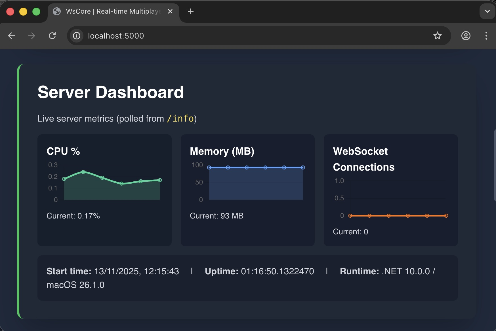
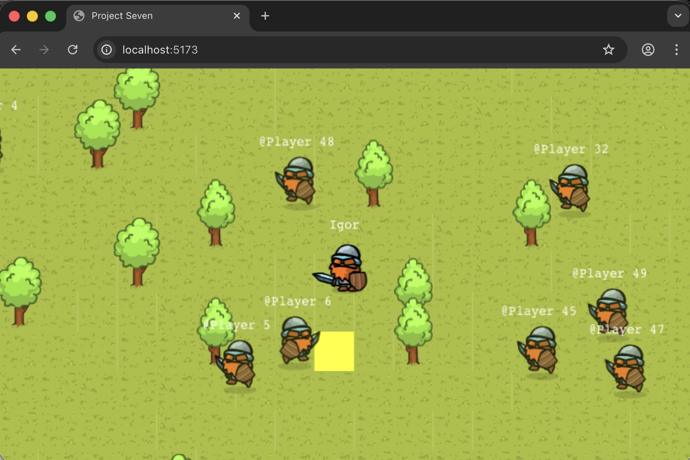
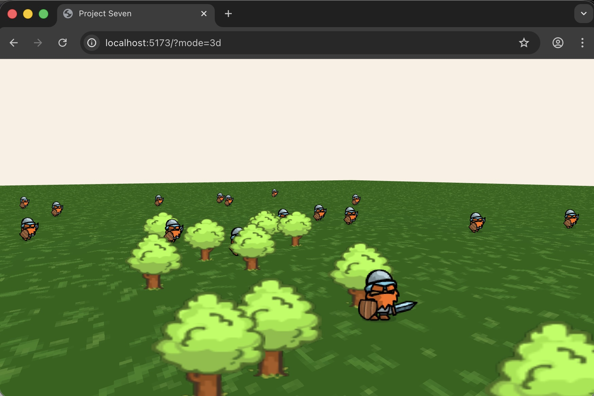

# WsCore

A high-performance, real-time game server built with .NET 10 and WebSocket, designed for multiplayer game development with an efficient MemoryPack-based binary protocol. Features both 2D (Phaser) and 3D (Three.js) client samples for flexible gameplay experiences.

**🚀 Production Ready:** Docker setup with automated deployment scripts for VDS. See [docs/](docs/) for deployment guides.

## Screenshots


*WsCore Server Dashboard - Real-time server monitoring and metrics*

## Client Samples

### 2D Client (Phaser)

*Traditional 2D rendering with sprite-based gameplay*

### 3D Client (Three.js)

*Modern 3D isometric rendering with WebGL acceleration*

## Architecture Overview

WsCore implements a modular, scalable architecture that separates concerns across multiple layers:

### Core Components

#### 1. **WebSocket Server (`WsServer/`)**
- **ASP.NET Core 10 WebSocket handler** for real-time bidirectional communication
- **Dependency injection** for loose coupling and testability
- **Static file serving** for web-based game clients
- **Connection lifecycle management** with proper cleanup and error handling

#### 2. **Game Engine (`GameServerBase`)**
- **Fixed 30 FPS game loop** using `PeriodicTimer` for consistent updates
- **Abstract game model** pattern allowing custom game logic implementation
- **Event-driven architecture** with player join/leave and tick events
- **Automatic player management** with unique ID assignment

#### 3. **Serialization Protocol (MemoryPack)**
- **MemoryPack** for ultra-fast, low-allocation serialization across server and client
- **1-byte message header**: leading TypeId followed by MemoryPack payload
- **TypeScript codegen**: MemoryPack generates TS reader/writer and models into `WsCore.Client/src/network/protocol`
- Legacy DataBuffer layer is deprecated and removed from runtime

#### 4. **Message System (`WsServer.Shared/`)**
- **Reflection-based message discovery** automatically scanning assemblies for message types
- **Type-safe message handling** with compile-time verification
- **Request/Response pattern** for client-server communication
- **Message serialization** via MemoryPack with automatic type mapping

#### 5. **Client Code (Dual Client Support)**
- **2D Client (Phaser)**: Traditional 2D rendering and input handling
- **3D Client (Three.js)**: Modern WebGL-based isometric 3D rendering
- **Auto-generated TS models** produced by MemoryPack source generator during server build (see `WsServer/Game/Game.csproj`)
- **Type-safe client API** matching server-side message contracts
- **Binary protocol**: reads 1-byte TypeId then MemoryPack payload using generated `MemoryPackReader`
- **Real-time message handling** with event callbacks

## Base Concepts and Principles

### 1. **Performance-First Design**
- **MemoryPack binary protocol** eliminates JSON parsing overhead
- **Fixed timestep game loop** ensures consistent simulation
- **Minimal allocations** through MemoryPack + pooling where appropriate
- **Connection lifecycle optimizations** and resource management

### 2. **Type Safety**
- **Compile-time message verification** through reflection
- **Strongly-typed game models** preventing runtime errors
- **Interface-based architecture** enabling proper dependency injection
- **Generic constraints** ensuring type compatibility

### 3. **Extensibility**
- **Plugin-based message handlers** for easy feature addition
- **Abstract base classes** allowing custom game logic
- **Modular component design** for flexible architecture
- **Assembly scanning** for automatic feature discovery

### 4. **Real-Time Communication**
- **WebSocket-based** full-duplex communication
- **Broadcast messaging** for efficient state synchronization
- **Connection state management** with automatic cleanup
- **Binary message framing**: `[TypeId:byte][MemoryPack payload]`

## Working Principles

### Game Loop
```csharp
// 30 FPS fixed timestep
private async Task RunGameLoopAsync()
{
    var timer = new PeriodicTimer(TimeSpan.FromMilliseconds(33));
    while (await timer.WaitForNextTickAsync())
    {
        GameModel.UpdateGameState(DateTime.Now, () => OnTick?.Invoke());
    }
}
```

### Message Processing
1. **Client sends binary message** via WebSocket as `[TypeId][MemoryPack payload]`
2. **Server reads header** to determine message type, then MemoryPack-deserializes payload
3. **Reflection system** finds appropriate handler (request handlers and event registrations)
4. **Handler processes** request and updates game state
5. **Server broadcasts** state changes to relevant clients using the same header + MemoryPack format

### Client Code Generation (MemoryPack)
1. **Assembly scanning** discovers all `[MemoryPackable]` message types
2. **MemoryPack source generator** outputs TypeScript classes/readers/writers
3. **Client uses generated reader/writer** to serialize/deserialize payloads
4. **Client API** provides type-safe message sending/receiving

## Project Structure

```
WsCore/
├── WsCore.Client/               # Dual client TypeScript (Vite)
│   ├── src/
│   │   ├── 2d/                 # 2D Phaser client
│   │   ├── 3d/                 # 3D Three.js client
│   │   └── network/protocol    # Auto-generated MemoryPack TS files
├── WsServer/
│   ├── WsServer/               # ASP.NET Core 10 WebSocket host
│   ├── Game/                   # Game logic and protocol definitions
│   └── WsServer.Shared/        # Messaging, serialization, reflection registry
```

## Client Quickstart

Run client and server separately during development:

```bash
# Terminal 1: server
cd WsServer/WsServer
dotnet run

# Terminal 2: client
cd WsCore.Client
npm install
npm start
```

### Client Access
- **2D Version**: `http://localhost:5173/`
- **3D Version**: `http://localhost:5173/?mode=3d`

Both clients share the same game logic, assets, and network protocol while providing different visual experiences.

Note: The server and client are intentionally started manually (no auto-run from tools). MemoryPack-generated TS files will appear under `WsCore.Client/src/network/protocol` after building the server.

## Key Interfaces

- **`IGameServer`**: Core server functionality
- **`IGameModel`**: Game state management
- **`IGameMessenger`**: Message broadcasting
- **`IMessageSerializer`**: MemoryPack header + payload serialization/deserialization
- **`IClientConnection`**: WebSocket connection abstraction

## Usage Example

The server automatically discovers game logic from assemblies containing message and handler definitions, making it easy to extend with new features without modifying core server code.

```csharp
// Server automatically discovers and registers
// all IClientRequest and IServerEvent implementations
builder.Services.AddSingleton<IServerLogicProvider, ReflectionServerLogicProvider>(
    sc => new ReflectionServerLogicProvider(typeof(ChatMessageEvent).Assembly,
    new ClientRequestHandlerFactory(sc)));
```

### Development: Run server and client
Start the server manually from `WsServer/WsServer` and the client from `WsCore.Client`.

```bash
# Terminal 1
dotnet run

# Terminal 2 (default Vite URL: http://localhost:5173)
npm start
```

Note: In development, the server and client are started separately. Automated tools should not start them.

## Client Features Comparison

| Feature | 2D (Phaser) | 3D (Three.js) |
|---------|-------------|---------------|
| Rendering | Traditional 2D sprites | WebGL 3D isometric |
| Camera | Following camera | Orthographic isometric |
| Performance | GPU-accelerated | GPU-accelerated |
| Assets | Shared across both clients | Shared across both clients |
| Controls | Arrow keys + mouse | Arrow keys + mouse |
| Multiplayer | ✅ Full support | ✅ Full support |

The dual-client approach allows developers to choose the visual style that best fits their game concept while maintaining the same core gameplay mechanics and server infrastructure.

## 🐳 Docker & Deployment

WsCore includes production-ready Docker setup with automated deployment scripts.

### Quick Deploy
```bash
# Make scripts executable
chmod +x scripts/*.sh

# Test locally
docker-compose up -d && curl http://localhost && docker-compose down

# Deploy to VDS
./scripts/deploy-vds.sh deploy@your-vds-ip ~/gameserver

# Setup HTTPS
./scripts/setup-ssl.sh deploy@your-vds-ip your-domain.com admin@example.com
```

### Documentation
- 📖 **[docs/QUICKSTART.md](docs/QUICKSTART.md)** - 5-minute quick start
- 📖 **[docs/DEPLOYMENT_GUIDE.md](docs/DEPLOYMENT_GUIDE.md)** - Complete deployment guide
- 📖 **[docs/INDEX.md](docs/INDEX.md)** - Full documentation index
- ⚙️ **[docs/CONFIG_EXAMPLES.md](docs/CONFIG_EXAMPLES.md)** - Advanced configurations

### Docker Image Details
- **Base Images**: Node.js 20-alpine (client), .NET 10 (server)
- **Size**: ~379 MB
- **Output**: Single optimized container with client + server
- **Features**: Nginx reverse proxy, SSL/TLS, health checks, non-root user

### Managing Deployments (Update & Monitor)

Once deployed, use these commands to manage your running instance:

#### Check Server Status
```bash
ssh <user>@<your-vds-host> 'cd <deploy-dir> && docker compose ps'
```

#### View Application Logs
```bash
ssh <user>@<your-vds-host> 'cd <deploy-dir> && docker compose logs -f game-server'
```

#### Update Application (New Version)
```bash
# 1. Build new image locally
./scripts/build.sh wscore-game-server latest

# 2. Deploy updated image to server
./scripts/deploy.sh <user>@<your-vds-host> <deploy-dir>
```

#### Restart Services
```bash
ssh <user>@<your-vds-host> 'cd <deploy-dir> && docker compose restart'
```

#### View Nginx Logs
```bash
ssh <user>@<your-vds-host> 'cd <deploy-dir> && docker compose logs -f nginx-proxy'
```

**Placeholders:**
- `<user>` - SSH user (e.g., `root` or `deploy`)
- `<your-vds-host>` - Server hostname/IP (e.g., `example.com`)
- `<deploy-dir>` - Deployment directory (e.g., `~/WsCoreServer`)
